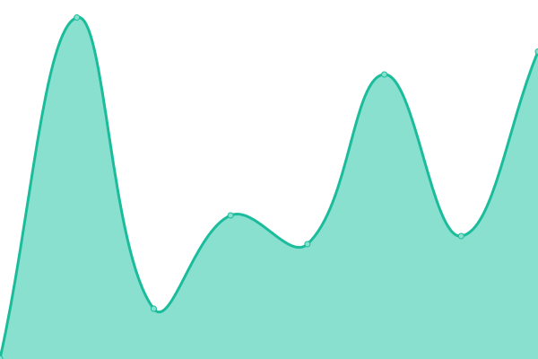
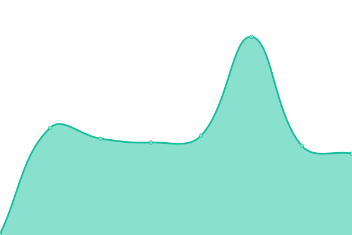
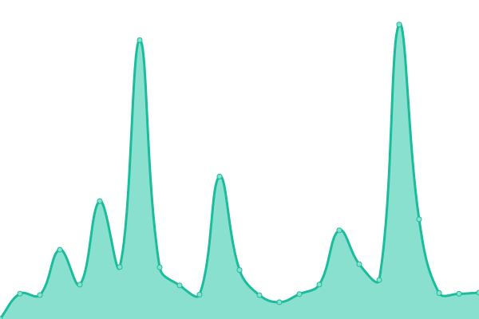
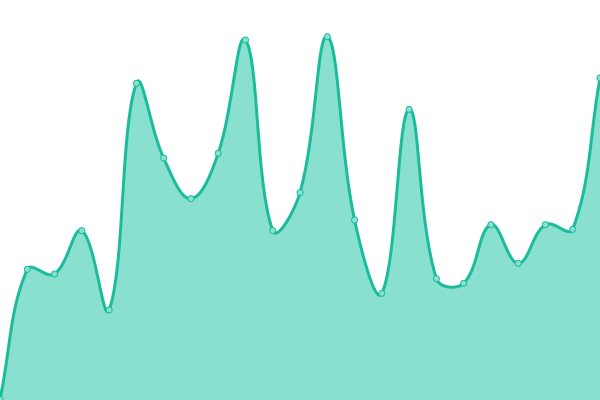
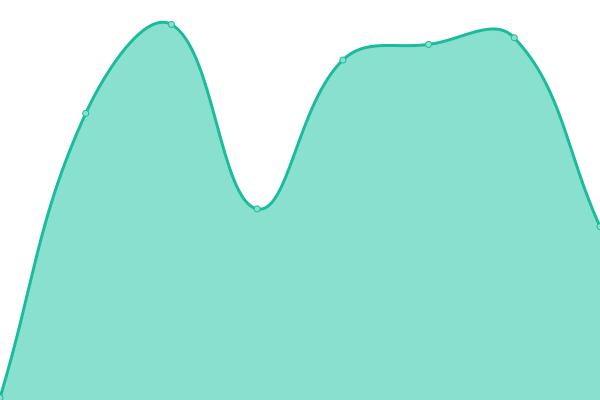
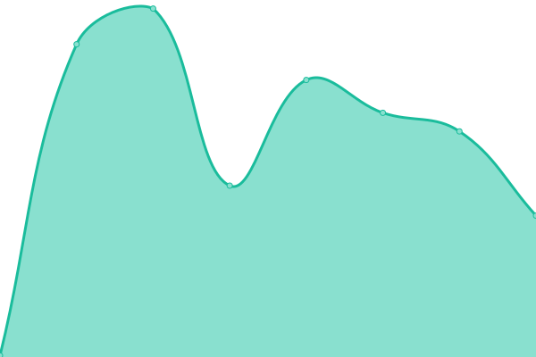
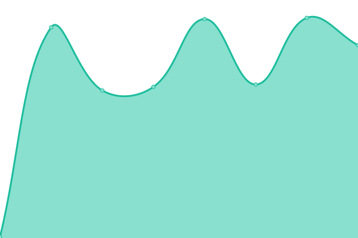
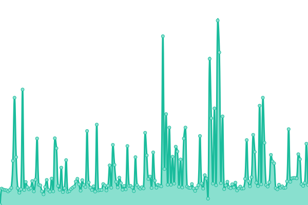

# [📈 Live Status](https://up.fragile.ventures): <!--live status--> **🟧 Partial outage**

This repository contains the open-source uptime monitor and status page for [I Plan Websites](http://iplanwebsites.com), powered by [Upptime](https://github.com/upptime/upptime).

With [Upptime](https://upptime.js.org), you can get your own unlimited and free uptime monitor and status page, powered entirely by a GitHub repository. We use [Issues](https://github.com/iplanwebsites/up/issues) as incident reports, [Actions](https://github.com/iplanwebsites/up/actions) as uptime monitors, and [Pages](https://up.fragile.ventures) for the status page.

<!--start: status pages-->
<!-- This summary is generated by Upptime (https://github.com/upptime/upptime) -->
<!-- Do not edit this manually, your changes will be overwritten -->
<!-- prettier-ignore -->
| URL | Status | History | Response Time | Uptime |
| --- | ------ | ------- | ------------- | ------ |
|  [Fragile ventures (web)](https://fragile.ventures) | 🟩 Up | [fragile-ventures-web.yml](https://github.com/iplanwebsites/up/commits/HEAD/history/fragile-ventures-web.yml) | 

 264ms
     
 | 

<a href="https://up.fragile.ventures/history/fragile-ventures-web">100.00%</a>
    

|  [Lovely (brochure)](https://lovely.link/) | 🟩 Up | [lovely-brochure.yml](https://github.com/iplanwebsites/up/commits/HEAD/history/lovely-brochure.yml) | 

 134ms
     
 | 

<a href="https://up.fragile.ventures/history/lovely-brochure">100.00%</a>
    

|  [Lovely (img)](https://img.lovely.link/v1/invitation/profile?title=title&text1=text1&text2=text2&text3=text3&avatar=https%3A%2F%2Frandomuser.me%2Fapi%2Fportraits%2Fwomen%2F67.jpg&rating5=0) | 🟩 Up | [lovely-img.yml](https://github.com/iplanwebsites/up/commits/HEAD/history/lovely-img.yml) | 

 4928ms
     
 | 

<a href="https://up.fragile.ventures/history/lovely-img">100.00%</a>
    

|  [Lovely (demo)](https://demo.lovely.link/) | 🟩 Up | [lovely-demo.yml](https://github.com/iplanwebsites/up/commits/HEAD/history/lovely-demo.yml) | 

 123ms
     
 | 

<a href="https://up.fragile.ventures/history/lovely-demo">100.00%</a>
    

|  [Invitation (web)](https://invitation.codes/) | 🟥 Down | [invitation-web.yml](https://github.com/iplanwebsites/up/commits/HEAD/history/invitation-web.yml) | 

 278ms
     
 | 

<a href="https://up.fragile.ventures/history/invitation-web">0.00%</a>
    

|  [Invitation (next)](https://next.invitation.codes/) | 🟥 Down | [invitation-next.yml](https://github.com/iplanwebsites/up/commits/HEAD/history/invitation-next.yml) | 

 212ms
     
 | 

<a href="https://up.fragile.ventures/history/invitation-next">0.00%</a>
    

|  [Invitation (og.invt.co - v1)](https://og.invt.co/felix.png?fontSize=%40felix&theme=light&md=1&images=https%3A%2F%2Flh3.googleusercontent.com%2Fa-%2FAOh14GjUk2VKmkWxpgWZgY0CXWRFi_k6t7f2MBSsfSxR%3Ds96-c) | 🟩 Up | [invitation-og-invt-co-v1.yml](https://github.com/iplanwebsites/up/commits/HEAD/history/invitation-og-invt-co-v1.yml) | 

 580ms
     
 | 

<a href="https://up.fragile.ventures/history/invitation-og-invt-co-v1">100.00%</a>
    

|  [Kicking (web)](https://kickinglotus.com/en) | 🟩 Up | [kicking-web.yml](https://github.com/iplanwebsites/up/commits/HEAD/history/kicking-web.yml) | 

 136ms
     
 | 

<a href="https://up.fragile.ventures/history/kicking-web">100.00%</a>
    

|  [Kicking (recu)](https://recu.kickinglotus.com/) | 🟥 Down | [kicking-recu.yml](https://github.com/iplanwebsites/up/commits/HEAD/history/kicking-recu.yml) | 

 210ms
     
 | 

<a href="https://up.fragile.ventures/history/kicking-recu">100.00%</a>
    

|  [CounterApi (brochure)](https://counterapi.com/) | 🟩 Up | [counter-api-brochure.yml](https://github.com/iplanwebsites/up/commits/HEAD/history/counter-api-brochure.yml) | 

 158ms
     
 | 

<a href="https://up.fragile.ventures/history/counter-api-brochure">100.00%</a>
    

|  [NowBoarding (tokyo)](https://tokyo.nowboarding.club/) | 🟩 Up | [now-boarding-tokyo.yml](https://github.com/iplanwebsites/up/commits/HEAD/history/now-boarding-tokyo.yml) | 

 140ms
     
 | 

<a href="https://up.fragile.ventures/history/now-boarding-tokyo">100.00%</a>
    

<!--end: status pages-->

[**Visit our status website →**](https://up.fragile.ventures)

## 📄 License

- Powered by: [Upptime](https://github.com/upptime/upptime)
- Code: [MIT](./LICENSE) © [I Plan Websites](http://iplanwebsites.com)
- Data in the `./history` directory: [Open Database License](https://opendatacommons.org/licenses/odbl/1-0/)
